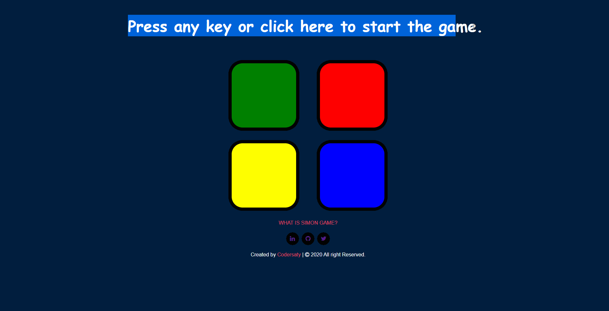

<h1 align="center" id="top">Welcome to Simon Game👋</h1>

# Basic Overview

> This project is a simple responsive website to replicate a [simon game](https://en.wikipedia.org/wiki/Simon_(game)) developed to practice jquery.
 

# Table of Contents

- [Description](#description)
- [Technologies Used](#technologies)
- [References](#references)
- [License](#license)
- [ToDos](#To-Dos)
- [Related Projects](#related-projects)
- [Support](#support)
- [Author Info](#author-info)

 

# Description

A simple and easy to use responsive website created using HTML5, CSS and jQuery to replicate an electronic simon game. Simon is an electronic game of memory skill invented by Ralph H. Baer and Howard J. Morrison.
The device has four colored buttons, each producing a particular tone when it is pressed or activated by the device. A round in the game consists of the device lighting up one or more buttons in a random order, after which the player must reproduce that order by pressing the buttons. As the game progresses, the number of buttons to be pressed increases. 

[Live Demo](https://codersaty.github.io/Simon-Game/)

 

# Technologies

- [HTML5](https://en.wikipedia.org/wiki/HTML5)
- [CSS3](https://en.wikipedia.org/wiki/CSS)
- [Jquery](https://en.wikipedia.org/wiki/JQuery)
- [Git](https://en.wikipedia.org/wiki/Git)
- [Markdown](https://en.wikipedia.org/wiki/Markdown)

### Tools used

- [VS Code](https://en.wikipedia.org/wiki/Visual_Studio_Code)
- [Github](https://en.wikipedia.org/wiki/GitHub)

 

# References

I have used the following resources in creation of this project:

- [The Complete 2021 Web Development Bootcamp](https://www.udemy.com/course/the-complete-web-development-bootcamp/)

 

# License

[MIT License](LICENSE.md)

Copyright (c) 2021 @[codersaty](http://codersaty.me)

 

# To Dos

> Thinking About it.

 

# Related Projects

> I will add the projects soon.

 

# Support

In case of any problem/ query, feel free to do pull requests or contact the author.

 

# Author Info

- Twitter - [@codersaty](https://twitter.com/codersaty)
- Website - [Anuranjan Srivastava](http://codersaty.me)
- Linkedin - [codersaty](https://www.linkedin.com/in/codersaty)

 

[Back To The Top](#top)